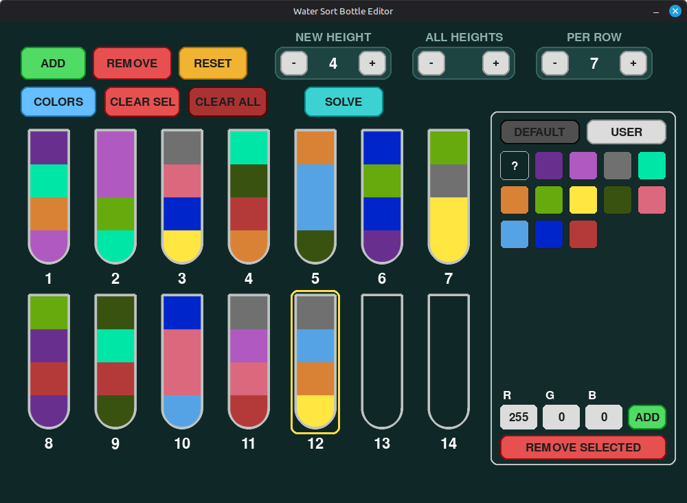
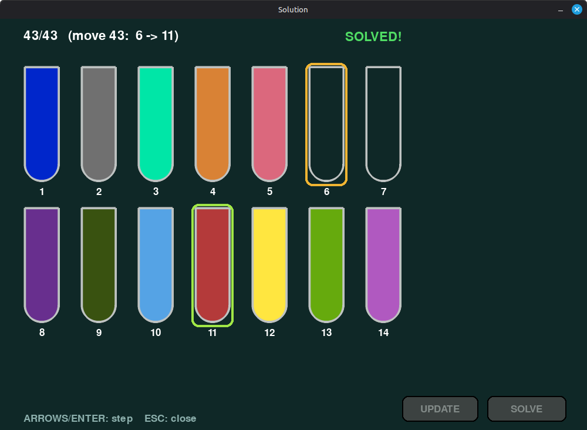

# Water Sort Solver & Editor

Editor and solver for Water Sort puzzles with step-by-step solutions and hidden-color support.



---

## The story

I was enjoying Water Sort until I hit a level with hidden colors. I had solved plenty of those before, but this one took so much time and effort that I got stuck. I hate it when something blocks my progress, so I wrote a C++ solver using DFS to walk me through the solution and help figure out the colors.

Months later, with the help of AI, I built a pygame UI around it — much easier and nicer to use than staring at terminal output.

---

## What it does

- **Build puzzles** in a visual bottle editor
- **Solve them** with a fast C++ DFS solver
- **Step through solutions** move by move
- **Handle hidden colors** (`?`) — the kind of levels where you only discover a color once it reaches the top

Hidden-color levels work like this:

1. Solve the puzzle until a `?` reaches the top of a bottle
2. Assign the color you see in your game
3. **SOLVE** again from that state, or **UPDATE** to write your choices back to the editor

---

## Demo



### Level 1008 — normal puzzle

A standard level solved step by step.

<video src="demo/level-1008-normal.mp4" controls width="100%"></video>

### Level 1007 — hidden colors

A hidden-color level, sped up 5× (2:08). The solver walks through the moves; on the final step you assign colors to revealed `?` tiles and keep going.

<video src="demo/level-1007-hidden.mp4" controls width="100%"></video>

---

## Features

### Editor
- Add, remove, and resize bottles
- Pick colors from a default palette or build your own
- Paint layers, clear bottles, and reset the board
- Save and load puzzles automatically (`bottles.txt`)
- Hotkeys: `Backspace` clears the selected bottle, `Delete` removes a bottle or a custom palette color

### Solver
- DFS-based C++ engine
- Detects unsolvable puzzles
- Supports `?` for hidden / unknown layers

### Solution viewer
- Step forward and backward through every move
- Hold arrow keys to auto-repeat through steps
- Paint hidden colors on the final board
- **SOLVE** — re-run the solver from the current state
- **UPDATE** — apply painted colors to the original puzzle and return to the editor

---

## Getting started

### Requirements

- Python 3
- [pygame](https://www.pygame.org/)
- A C++ compiler (to build the solver)

### Install

```bash
pip install pygame
```

### Build the solver

```bash
g++ -O2 -std=c++17 main.cpp -o solver
```

### Run

```bash
python main.py
```

The editor loads your last session from `bottles.txt` on startup.

---

## Controls

### Editor

| Action | Control |
|---|---|
| Select bottle | Click a bottle |
| Paint with active color | Click a layer |
| Open color picker | **COLORS** button |
| Solve | **SOLVE** button |
| Clear selected bottle | `Backspace` |
| Remove selected bottle | `Delete` |

### Solution viewer

| Action | Control |
|---|---|
| Next step | `→` `↓` `Enter` `Space` |
| Previous step | `←` `↑` |
| First / last step | `Home` / `End` |
| Close | `Esc` |

---

## Puzzle file format

Puzzles are stored in `bottles.txt`:

```
3
4 0
4 2 255,0,0 0,128,255
4 4 176,89,192 217,130,53 ? 104,47,142
```

- First line: number of bottles
- Each bottle: `capacity layer_count color color ...`
- Colors are `R,G,B` tuples
- Hidden colors are written as `?`
- Empty bottles: `capacity 0`

---

## Project structure

```
main.py          # pygame editor and solution viewer
main.cpp         # DFS solver source
solver           # compiled solver binary (built locally)
bottles.txt      # saved puzzle state
user_palette.txt # custom color palette
demo/            # screenshots and demo videos
```

---

## License

MIT — see [LICENSE](LICENSE).
